  

<h1>

Yo!👋 (´ω ｀).
</h1>

###

###

 

  <h2 align="center">Skills</h2>
  

    
    
    
    
    
    
    
    
    
    
    
  

###

 

<h2 align="center">Stats</h2>

  
  

  

###

 

  

  

###

<h2 align="center">Visits</h2>

  
   
  

###

###
